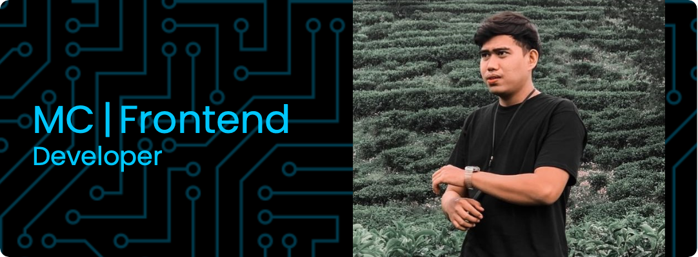

## Hi there 👋
Stepping out of the comfort zone
never stopping the learning journey.

## My Portfolio

**Muhammadchaerullah/muhammadchaerullah** is a ✨ _special_ ✨ repository because its `README.md` (this file) appears on your GitHub profile.

Here are some ideas to get you started:

- 🤔 I’m looking for help with React & Next js
- ⚡ Fun fact : I use GPT for my correction my code :D
- 🔭 I am currently looking for job opportunities.
- 🌱 I’m currently learning React & Next Js

#### Skills

#### How to reach me 

 